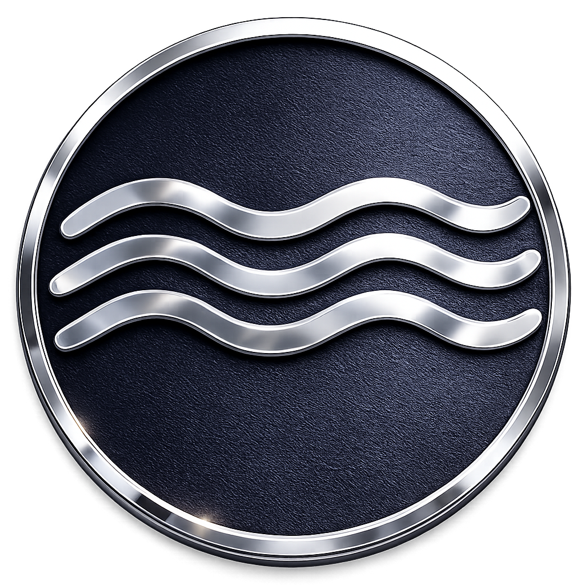

<!-- markdownlint-disable MD001 MD013 MD033 MD041 MD060 -->

<div align="center">



# Anclora Group Landing

### Landing page pubblica aziendale dell'ecosistema Anclora Group

Landing page pubblica che presenta l'intero ecosistema di prodotti Anclora, con brand book proprio (navy/signal-blue/command-purple) e interfaccia multilingue.

[Español](./README.md) · [Català](./README.ca.md) · [English](./README.en.md) · [Deutsch](./README.de.md) · [Français](./README.fr.md) · **Italiano**

<br />


-5FA8FF)


</div>

---

> [!IMPORTANT]
> Repository pubblico ridotto. Descrive la landing page e la sua architettura concettuale; non espone logica operativa, segreti o dati reali.

## Cos'è

Anclora Group Landing è la landing page pubblica aziendale dell'ecosistema. A differenza del resto della famiglia portfolio/showcase, implementa il brand book completo di Anclora Group (navy/signal-blue/command-purple) invece del tema editoriale generico — è l'unica app portfolio governata dal Master Contract di branding anziché dal contratto portfolio/showcase.

## Categoria nell'ecosistema

| Campo | Valore |
|---|---|
| Categoria | Portfolio — eccezione con brand book proprio |
| Accento del marchio | `#5FA8FF` (signal blue) + `#6C63FF` (command purple) |
| Tipografia | DM Sans + JetBrains Mono |
| Repository canonico | `anclora-group-landing` |

## Funzionalità principali

- Presentazione unificata dell'intero ecosistema di prodotti Anclora
- Sistema di marchio applicato con token, logo e palette unificati
- Interfaccia multilingue con selettore nativo (6 lingue nel prodotto: ES, EN, CA, DE, FR, IT)
- Narrativa guidata dal founder, metodo e principi

## Stack tecnologico

| Area | Tecnologia |
|---|---|
| Framework | React 19, Vite, TypeScript |
| Testing | Vitest, Testing Library |
| i18n | Sistema proprio, 6 lingue |

## Avvio locale

```bash
npm install
npm run dev
```

## Lingue supportate

Il prodotto in produzione supporta 6 lingue: Español (predefinita), Català, English, Deutsch, Français, Italiano (`LOCALES`, `src/i18n/index.ts`). Questa documentazione è mantenuta in tutte le 6 lingue del prodotto.

## Documentazione e governance

- [Brand book v2](./brand/anclora-group-brand-book-v2.md)
- [Prompt maestro della landing](./brand/anclora-group-prompt-maestro-landing-v3.md)
- Contratti di marchio e governance: [`docs/standards/`](./docs/standards/)
- Anclora Vault (fonte di verità): `contracts/` e `docs/governance/`

---

<div align="center">

### Anclora Group

</div>
